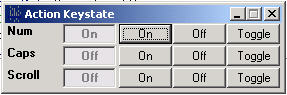

## ActionKeyState

### Description

A modification on Phobos submission for manipulation CapsLock, ScrollLock and NumLock. I made a function to either get the status or set (On, off, toggle) the status for these keys. Since i don't have Win95/98, i left that code out but feel free to enhance the function to include win95/98 (see phobos code)
 
### More Info
 

             |
---                |---
**Submitted On**   |2003-05-28 11:17:02
**By**             |[Martin Idman](https://github.com/Planet-Source-Code/PSCIndex/blob/master/ByAuthor/martin-idman.md)
**Level**          |Beginner
**User Rating**    |4.8 (24 globes from 5 users)
**Compatibility**  |VB 6\.0
**Category**       |[VB function enhancement](https://github.com/Planet-Source-Code/PSCIndex/blob/master/ByCategory/vb-function-enhancement__1-25.md)
**World**          |[Visual Basic](https://github.com/Planet-Source-Code/PSCIndex/blob/master/ByWorld/visual-basic.md)
**Archive File**   |[ActionKeyS1875154112005\.zip](https://github.com/Planet-Source-Code/martin-idman-actionkeystate__1-45771/archive/master.zip)

